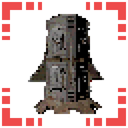

# RANDOM DELIVERY

**Language / Язык:** [English](#english) · [Русский](#russian)

## RANDOM DELIVERY

**Author:** Solo00n

Every morning the item dropship flies in and drops a free batch of random shop items on your landing pad — except some of them arrive as live traps or hostile monsters instead.

### WHAT IT DOES

- <strong style="color: #cc0000;">Daily air-drop</strong> — the game's real item dropship is dispatched on schedule, lands by the ship and drops a batch of <strong style="color: #cc0000;">2–4</strong> random buyable items, for free (your credits are untouched).
- <strong style="color: #cc0000;">Auto item pool</strong> — pulls every orderable item from the terminal shop, including ones other mods add; ship upgrades are excluded.
- <strong style="color: #cc0000;">Selection modes</strong> — <code>Random</code> (equal chance) or <code>PriceWeighted</code> (cheaper items are more likely, with an optional on-sale boost).
- <strong style="color: #cc0000;">Traps and monsters</strong> — each slot can instead be a live trap (Turret / Landmine) or a small monster, dropped at the ship's own spots when its hatch opens.
- <strong style="color: #cc0000;">Whole-delivery modes</strong> — a once-per-delivery chance the entire delivery is all traps, or all monsters.
- <strong style="color: #cc0000;">Allow / block lists</strong> — for items, traps and monsters, so you decide exactly what can arrive.
- <strong style="color: #cc0000;">Flexible schedule</strong> — dispatch time(s) on the in-game clock, several deliveries per day, per-slot replacement chances.
- <strong style="color: #cc0000;">In-game config</strong> — every setting is editable live through LethalConfig.

### HOW IT WORKS

- Items ride the vanilla <code>ItemDropship</code>: the chosen indices are added to <code>Terminal.orderedItemsFromTerminal</code> (the same list a paid order uses, minus the credit charge), so the ship flies in, lands and drops them exactly where terminal orders land.
- The descent is started at the scheduled <code>DeliveryTimes</code> clock time, and traps/monsters spawn at the ship's own item-drop spots the moment its hatch opens, so everything arrives together in the same place.
- Monsters spawn via <code>RoundManager.SpawnEnemyGameObject</code>, traps via <code>NetworkObject.Spawn</code> — no custom network objects.
- The monster pool is built from every loaded <code>EnemyType</code> filtered by the allow-list, so any allowed small monster can appear on any moon.

### MULTIPLAYER (HOST-AUTHORITATIVE)

<blockquote style="border-left: 4px solid #cc0000; padding-left: 15px;">
Only the <strong style="color: #cc0000;">host generates and dispatches deliveries</strong>; clients never generate their own, so everyone shares one authoritative delivery.
  
<strong style="color: #cc0000;">Items:</strong> queued onto the host's terminal order and delivered by the game's own dropship, which replicates to all clients. 
<strong style="color: #cc0000;">Traps and monsters:</strong> spawned server-side through <code>NetworkObject.Spawn</code> / <code>SpawnEnemyGameObject</code>, so all clients see the same result. 
<strong style="color: #cc0000;">Install:</strong> the host must have the mod; clients receive everything through Netcode. Install it on everyone so the whole lobby shares the same config.
</blockquote>

### REQUIREMENTS

- <strong style="color: #cc0000;">BepInEx</strong> 5.4.21+ (<code>BepInEx-BepInExPack-5.4.2100</code>)
- Lethal Company <strong style="color: #cc0000;">V81</strong>
- Optional: <strong style="color: #cc0000;">LethalConfig</strong> for editing settings in-game.

### INSTALLATION

- <strong style="color: #cc0000;">Mod manager</strong> (r2modman / Thunderstore Mod Manager): search for the mod and click Install.
- <strong style="color: #cc0000;">Manual:</strong> install the BepInEx pack, then drop <code>RandomDelivery.dll</code> into <code>BepInEx/plugins/</code>.

### CONFIGURATION

File: <code>BepInEx/config/Timofey.RandomDelivery.cfg</code> (created on first launch). The <code>.cfg</code> is re-read at the start of every day, and can also be edited live in the LethalConfig menu.

<table border="1" style="border-collapse: collapse; border: 1px solid #cc0000;">
<tr style="background: #1a1a1a;">
<th style="color: #cc0000;">Key</th><th style="color: #cc0000;">Default</th><th style="color: #cc0000;">Description</th>
</tr>
<tr><td><code>Enabled</code></td><td><code>true</code></td><td>Master switch for the whole mod.</td></tr>
<tr><td><code>DeliveryTimes</code></td><td><code>08:30</code></td><td>Comma-separated in-game times the dropship is dispatched (day starts 06:00). Each is an <code>HH:MM</code> time, <code>StartOfDay</code>, or a number of seconds after landing. List several for multiple deliveries.</td></tr>
<tr><td><code>MaxDeliveriesPerDay</code></td><td><code>1</code></td><td>Hard cap on deliveries per day.</td></tr>
<tr><td><code>MinItems</code> / <code>MaxItems</code></td><td><code>2</code> / <code>4</code></td><td>Slots per delivery (inclusive range).</td></tr>
<tr><td><code>ItemSelectionMode</code></td><td><code>Random</code></td><td><code>Random</code> or <code>PriceWeighted</code>.</td></tr>
<tr><td><code>PriceWeightFactor</code></td><td><code>1.0</code></td><td>Price-weighting steepness (0 = flat, 1 = inverse price, 2 = strongly favour cheap).</td></tr>
<tr><td><code>DiscountBoost</code></td><td><code>true</code></td><td>Boost on-sale items in <code>PriceWeighted</code> mode.</td></tr>
<tr><td><code>DropshipAutoOpen</code></td><td><code>false</code></td><td>Open the hatch by itself on landing instead of waiting for a player.</td></tr>
<tr><td><code>ChanceForTrap</code> / <code>ChanceForMonster</code></td><td><code>15</code> / <code>10</code></td><td>Per-slot % chance a slot becomes a trap / a monster.</td></tr>
<tr><td><code>Priority</code></td><td><code>Monster</code></td><td>Winner when both a trap and a monster hit the same slot.</td></tr>
<tr><td><code>ChanceForAllTraps</code> / <code>ChanceForAllMonsters</code></td><td><code>0</code> / <code>0</code></td><td>Once-per-delivery chance the whole delivery is all traps / all monsters.</td></tr>
</table>

<blockquote style="border-left: 4px solid #cc0000; padding-left: 15px;">
The allow/block lists — <code>AllowedItems/BlockedItems</code>, <code>AllowedTraps/BlockedTraps</code>, <code>AllowedMonsters/BlockedMonsters</code> — live in the <code>ItemFilters</code>, <code>Traps</code> and <code>Monsters</code> sections. A non-empty <code>Allowed*</code> list acts as a whitelist; otherwise the matching <code>Blocked*</code> list applies.
</blockquote>

### COMPATIBILITY

- Automatically includes items other mods add to the terminal shop (reads <code>Terminal.buyableItemsList</code>).
- In-game configuration via <strong style="color: #cc0000;">LethalConfig</strong> (auto-detected, optional — no hard dependency).
- Uses the game's own dropship and vanilla networked spawns — no custom network objects, low conflict risk.
- Works on vanilla and modded moons; if a moon has no dropship, the delivery falls back to spawning on the pad next to the ship.

### BUILD

<pre style="border: 1px solid #cc0000; padding: 10px;">dotnet build -c Release</pre>

Output: <code>bin/Release/RandomDelivery.dll</code>. Game assemblies are referenced via the <code>LethalCompany.GameLibs.Steam</code> NuGet package as compile-only (<code>PrivateAssets="all"</code>) — no game files are distributed.

### CREDITS

- <strong style="color: #cc0000;">Solo00n</strong> — author.
- Built on <strong style="color: #cc0000;">BepInEx</strong> and <strong style="color: #cc0000;">HarmonyX</strong>.
- Licensed under <strong style="color: #cc0000;">MIT</strong>.

## RANDOM DELIVERY

**Автор:** Solo00n

Каждое утро грузовой дропшип прилетает и сбрасывает на посадочную площадку бесплатную партию случайных предметов из магазина — вот только часть из них прибывает в виде живых ловушек или враждебных монстров.

### ЧТО ДЕЛАЕТ МОД

- <strong style="color: #cc0000;">Ежедневная доставка</strong> — настоящий грузовой дропшип отправляется по расписанию, садится у корабля и сбрасывает партию из <strong style="color: #cc0000;">2–4</strong> случайных покупаемых предметов, бесплатно (баланс не меняется).
- <strong style="color: #cc0000;">Автопул предметов</strong> — берёт все заказываемые предметы из терминала, включая добавленные другими модами; улучшения корабля исключены.
- <strong style="color: #cc0000;">Режимы выбора</strong> — <code>Random</code> (равный шанс) или <code>PriceWeighted</code> (чем дешевле, тем вероятнее, с бонусом за скидку).
- <strong style="color: #cc0000;">Ловушки и монстры</strong> — любой слот может стать живой ловушкой (Турель / Мина) или маленьким монстром, которые высыпаются в точках выгрузки дропшипа при открытии люка.
- <strong style="color: #cc0000;">Режимы всей доставки</strong> — шанс один раз за доставку, что вся партия будет только из ловушек либо только из монстров.
- <strong style="color: #cc0000;">Белые / чёрные списки</strong> — для предметов, ловушек и монстров: вы точно решаете, что может прибыть.
- <strong style="color: #cc0000;">Гибкое расписание</strong> — время(-на) отправки по внутриигровым часам, несколько доставок в день, пошаговые шансы замены.
- <strong style="color: #cc0000;">Настройка в игре</strong> — все параметры меняются вживую через LethalConfig.

### КАК ЭТО РАБОТАЕТ

- Предметы едут на ванильном <code>ItemDropship</code>: выбранные индексы добавляются в <code>Terminal.orderedItemsFromTerminal</code> (тот же список, что и у платного заказа, но без списания кредитов), поэтому корабль прилетает, садится и сбрасывает их туда же, куда падают заказы из терминала.
- Спуск начинается в заданное время <code>DeliveryTimes</code>, а ловушки/монстры спавнятся в точках выгрузки дропшипа в момент открытия люка — так всё прибывает вместе и в одном месте.
- Монстры спавнятся через <code>RoundManager.SpawnEnemyGameObject</code>, ловушки — через <code>NetworkObject.Spawn</code>, без своих сетевых объектов.
- Пул монстров строится из всех загруженных <code>EnemyType</code> с фильтром по белому списку, поэтому любой разрешённый мелкий монстр может появиться на любой луне.

### МУЛЬТИПЛЕЕР (HOST-AUTHORITATIVE)

<blockquote style="border-left: 4px solid #cc0000; padding-left: 15px;">
Доставки генерирует и отправляет <strong style="color: #cc0000;">только хост</strong>; клиенты ничего не генерируют сами, поэтому у всех одна авторитетная доставка.
  
<strong style="color: #cc0000;">Предметы:</strong> добавляются в заказ терминала на хосте и доставляются дропшипом самой игры, что реплицируется всем клиентам. 
<strong style="color: #cc0000;">Ловушки и монстры:</strong> спавнятся на сервере через <code>NetworkObject.Spawn</code> / <code>SpawnEnemyGameObject</code>, поэтому итог одинаков у всех. 
<strong style="color: #cc0000;">Установка:</strong> мод обязателен у хоста; клиенты получают всё через Netcode. Ставьте всем, чтобы у всего лобби был общий конфиг.
</blockquote>

### ЗАВИСИМОСТИ

- <strong style="color: #cc0000;">BepInEx</strong> 5.4.21+ (<code>BepInEx-BepInExPack-5.4.2100</code>)
- Lethal Company <strong style="color: #cc0000;">V81</strong>
- Опционально: <strong style="color: #cc0000;">LethalConfig</strong> для настройки в игре.

### УСТАНОВКА

- <strong style="color: #cc0000;">Через менеджер</strong> (r2modman / Thunderstore Mod Manager): найти мод и нажать Install.
- <strong style="color: #cc0000;">Вручную:</strong> установить BepInEx-пак, затем положить <code>RandomDelivery.dll</code> в <code>BepInEx/plugins/</code>.

### НАСТРОЙКА

Файл: <code>BepInEx/config/Timofey.RandomDelivery.cfg</code> (создаётся при первом запуске). <code>.cfg</code> перечитывается в начале каждого дня и правится вживую в меню LethalConfig.

<table border="1" style="border-collapse: collapse; border: 1px solid #cc0000;">
<tr style="background: #1a1a1a;">
<th style="color: #cc0000;">Ключ</th><th style="color: #cc0000;">По умолчанию</th><th style="color: #cc0000;">Описание</th>
</tr>
<tr><td><code>Enabled</code></td><td><code>true</code></td><td>Главный выключатель мода.</td></tr>
<tr><td><code>DeliveryTimes</code></td><td><code>08:30</code></td><td>Список времён отправки дропшипа через запятую (день начинается в 06:00). Каждое — время <code>ЧЧ:ММ</code>, <code>StartOfDay</code> или число секунд после посадки. Перечислите несколько для нескольких доставок.</td></tr>
<tr><td><code>MaxDeliveriesPerDay</code></td><td><code>1</code></td><td>Жёсткий лимит доставок в день.</td></tr>
<tr><td><code>MinItems</code> / <code>MaxItems</code></td><td><code>2</code> / <code>4</code></td><td>Слотов за доставку (включительно).</td></tr>
<tr><td><code>ItemSelectionMode</code></td><td><code>Random</code></td><td><code>Random</code> или <code>PriceWeighted</code>.</td></tr>
<tr><td><code>PriceWeightFactor</code></td><td><code>1.0</code></td><td>Крутизна весов по цене (0 = ровно, 1 = обратно цене, 2 = сильный уклон в дешёвые).</td></tr>
<tr><td><code>DiscountBoost</code></td><td><code>true</code></td><td>Бонус к шансу товаров со скидкой в режиме <code>PriceWeighted</code>.</td></tr>
<tr><td><code>DropshipAutoOpen</code></td><td><code>false</code></td><td>Открывать люк автоматически при посадке, не дожидаясь игрока.</td></tr>
<tr><td><code>ChanceForTrap</code> / <code>ChanceForMonster</code></td><td><code>15</code> / <code>10</code></td><td>Пошаговый шанс (%) сделать слот ловушкой / монстром.</td></tr>
<tr><td><code>Priority</code></td><td><code>Monster</code></td><td>Кто побеждает, если в один слот выпали и ловушка, и монстр.</td></tr>
<tr><td><code>ChanceForAllTraps</code> / <code>ChanceForAllMonsters</code></td><td><code>0</code> / <code>0</code></td><td>Шанс один раз за доставку, что вся партия — только ловушки / только монстры.</td></tr>
</table>

<blockquote style="border-left: 4px solid #cc0000; padding-left: 15px;">
Белые/чёрные списки — <code>AllowedItems/BlockedItems</code>, <code>AllowedTraps/BlockedTraps</code>, <code>AllowedMonsters/BlockedMonsters</code> — находятся в разделах <code>ItemFilters</code>, <code>Traps</code> и <code>Monsters</code>. Непустой список <code>Allowed*</code> работает как белый список; иначе применяется соответствующий <code>Blocked*</code>.
</blockquote>

### СОВМЕСТИМОСТЬ

- Автоматически включает предметы, добавленные другими модами в магазин терминала (читает <code>Terminal.buyableItemsList</code>).
- Настройка в игре через <strong style="color: #cc0000;">LethalConfig</strong> (определяется автоматически, необязателен — жёсткой зависимости нет).
- Использует дропшип самой игры и ванильные сетевые спавны — без своих сетевых объектов, низкий риск конфликтов.
- Работает на ванильных и модовых лунах; если на луне нет дропшипа, доставка запасным путём спавнится на площадке у корабля.

### СБОРКА

<pre style="border: 1px solid #cc0000; padding: 10px;">dotnet build -c Release</pre>

Результат: <code>bin/Release/RandomDelivery.dll</code>. Сборки игры подключены через NuGet-пакет <code>LethalCompany.GameLibs.Steam</code> только для компиляции (<code>PrivateAssets="all"</code>) — файлы игры не распространяются.

### БЛАГОДАРНОСТИ

- <strong style="color: #cc0000;">Solo00n</strong> — автор.
- Построено на <strong style="color: #cc0000;">BepInEx</strong> и <strong style="color: #cc0000;">HarmonyX</strong>.
- Лицензия <strong style="color: #cc0000;">MIT</strong>.
